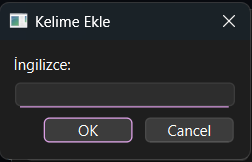
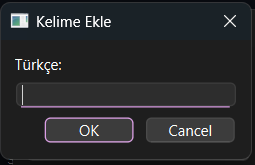
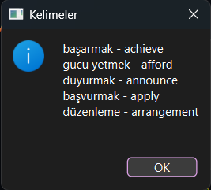
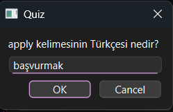
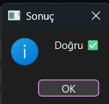

# İngilizce Kelime Öğrenme Uygulaması
# Proje-3
# PYTHON

-----------------------------------------------

# Proje Açıklaması
--------------------

Bu proje, İngilizce öğrenme sürecini desteklemek amacıyla geliştirilmiş bir masaüstü uygulamasıdır. Uygulama, kullanıcıların kelime bilgilerini geliştirmelerine, quizle öğrendikleri kelimeleri pekiştirmelerine olanak sağlar.

# Video
----------------
<a href="https://drive.google.com/file/d/1r6uVxfN2YfXU7WrKv8K1x0WbCcTKQAWF/view?usp=sharing">

Projeyi anlatan videoya ulaşmak için tıklayınız.

</a>

# Exe Dosyası
----------------

# Giriş Ekranı
----------------

Burada kullanıcı adı ve şifrenizi girerek sisteme giriş yapabilirsiniz ya da kayıtlı değilseniz kullanıcı adı ve şifre yazarak kayıt olabilirsiniz.

# Ana Menü
--------------

Burada istediğiniz kelimeleri anlamlarıyla ekleyebilir ve eklediğiniz kelimeleri listeleyebilir ve quiz yapabilirsiniz.

# Kelime Ekle
--------------

Burada eklemek istediğiniz kelimenini önce ingilizcesini sonra türkçesini yazıyorsunuz.

# Listele
-----------

Burada girdiğiniz kelimemeleri listeleyebilirsiniz.

# Quiz
--------

Burada size listedeki ingilizce kelimelerden herhangi birisi çıkıyor ve türkçesini soruyor cevabınıza göre doğru veya yanlış yazıyor.

