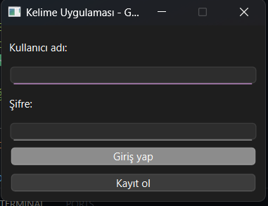
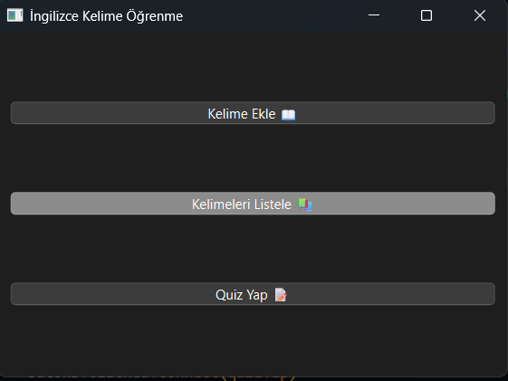

# İngilizce Kelime Öğrenme Uygulaması
# Proje-3
# PYTHON

# Proje Açıklaması
--------------------

Bu proje, İngilizce öğrenme sürecini desteklemek amacıyla geliştirilmiş bir masaüstü uygulamasıdır. Uygulama, kullanıcıların kelime bilgilerini geliştirmelerine, quizle öğrendikleri kelimeleri pekiştirmelerine olanak sağlar.

# Video
------------

# Exe Dosyası
----------------

# Giriş Ekranı
----------------

Burada kullanıcı adı ve şifrenizi girerek sisteme giriş yapabilirsiniz ya da kayıtlı değilseniz kullanıcı adı ve şifre yazarak kayıt olabilirsiniz

# Ana Menü
--------------

Burada istediğiniz kelimeleri anlamlarıyla ekleyebilir ve eklediğiniz kelimeleri listeleyebilir ve quiz yapabilirsiniz.

# Kelime Öğrenme
-----------------

# Quiz
-----------------

